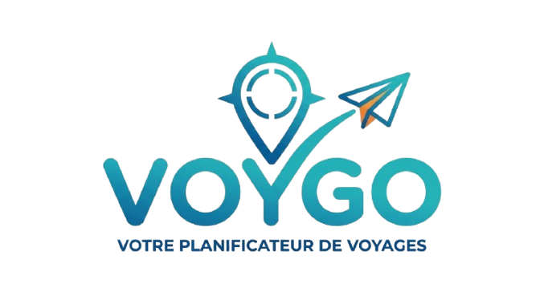

# Voygo

## Présentation

Voygo est une **application web permettant de créer, organiser et visualiser des voyages**.

L’objectif de l’application est de **centraliser toutes les informations d’un voyage** afin de faciliter l’organisation des séjours.

L’utilisateur peut :

- créer un voyage
- planifier ses activités
- organiser son transport et son logement
- visualiser son planning
- consulter une carte du voyage
- exporter les informations du séjour

---

# Fonctionnalités

## Création de voyages

L’utilisateur peut :

- créer un nouveau voyage
- modifier un voyage existant
- supprimer un voyage

Informations enregistrées :

- destination
- dates du voyage
- nombre de participants
- transport principal

---

## Gestion des activités

Pour chaque voyage, l’utilisateur peut :

- ajouter une activité
- modifier une activité
- supprimer une activité

Informations pour chaque activité :

- titre
- lieu
- date
- coût estimé

---

## Calendrier interactif

L’application propose un calendrier inspiré de Google Calendar permettant de visualiser :

- les activités
- les déplacements
- les logements
- les notes du voyage

---

## Tableau récapitulatif

Un tableau de synthèse est généré automatiquement avec :

| Jour | Destination | Activité principale | Logement | Transport | Coût estimé |
|-----|-------------|--------------------|----------|-----------|------------|
| 1 | Paris → Rome | Vol + installation | Hôtel Roma | Avion | 150€ |
| 2 | Rome | Visite du Colisée | Hôtel Roma | Métro | 60€ |
| 3 | Rome → Naples | Train + visite | Airbnb Napoli | Train | 80€ |

---

## Carte interactive

L’application intègre une carte permettant de visualiser les lieux du voyage.

Technologies utilisées :

- OpenStreetMap (données cartographiques)
- Leaflet (affichage de la carte)

Fonctionnalités :

- affichage des lieux sur la carte
- ajout de marqueurs pour les activités et logements
- visualisation des déplacements

---

# Technologies utilisées

## Front-end

- HTML
- CSS
- JavaScript

## Base de données

Le projet utilise **Supabase**, une base de données cloud basée sur PostgreSQL.

Supabase permet :

- le stockage des voyages
- la gestion des activités
- la récupération des données via API

## Bibliothèques

- Leaflet – affichage de la carte
- OpenStreetMap – données cartographiques

---

# Structure du projet
voygo/
│
├── index.html
├── css/
│ └── style.css
│
├── js/
│ ├── app.js
│ ├── calendar.js
│ ├── map.js
│ └── supabase.js
│
├── assets/
│ └── images
│
└── README.md

---

# Installation

1. Cloner le projet :
git clone https://github.com/TCambier/voygo.git

2. Ouvrir le projet dans un éditeur de code.

3. Configurer la connexion à Supabase
   * Ouvrez `voygo/assets/js/supabase.js` (ou `js/supabase.js` selon votre copie).
   * Remplacez les valeurs de `SUPABASE_URL` et `SUPABASE_ANON_KEY` par celles fournies par votre projet Supabase.
   * Vous pouvez ajouter des helpers pour vos contrôleurs directement dans ce fichier.

4. Assurez-vous que vos pages HTML importent le client Supabase et votre code JavaScript. Par exemple :
   ```html
   <script type="module" src="https://cdn.jsdelivr.net/npm/@supabase/supabase-js/+esm"></script>
   <script type="module" src="../assets/js/app.js"></script>
   ```

5. Lancer le projet avec un serveur local (ex : Live Server de VS Code).

---

# Objectif pédagogique

Ce projet a été réalisé dans le cadre d’un **projet étudiant de développement web**.

Objectifs :

- concevoir une application web
- manipuler une base de données cloud
- utiliser une API
- afficher une carte interactive
- organiser une application JavaScript

---

# Évolutions possibles

Améliorations possibles du projet :

- authentification utilisateur
- mode collaboratif
- calcul automatique du budget
- version mobile
- export PDF ou Excel
- partage de voyages
